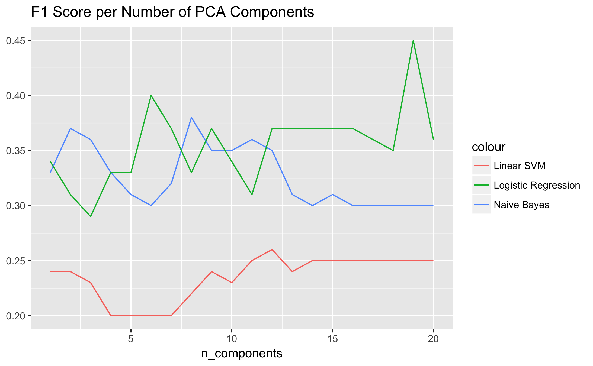

# Enron Email Investigation

In the wake of the Enron scandal, a lot of people wondered why and how such a large illegitimate operation was going on unnoticed. With the help of modern machine learning models, we can retroactively attempt to piece together the puzzle all while gaining valuable insight on how we might use similar models for auditing purposes in the future.

## Dataset

The goal of this project is to find person's of interest (POIs) in the Enron corporation. To accomplish this, we are looking at a large collection of emails as their respective employee records. In total, there are 146 employees on record, of which only 18 of them have been identified as POIs thus creating an unbalanced dataset. The low frequency of POIs in this dataset will present a challenge for the classifiers depending on the features available. This task is made even harder still by the lack of data for a lot of the 20 total features resulting in a fairly sparse data set. These factors combined with just low amount of data initially available make creating a robust model difficult to create.

## Outliers in dataset

Upon initial exploration of the dataset, I came across two very strange outliers that needed to be removed from the dataset. One was a simple aggregation key named "TOTAL" which is probably a remnant from a copy-paste from a spreadsheet. This aggregate key was quite noticeable in regression plots of continuous features and thus easily removed from consideration. Additionally, there was an unexplained key value that had the name "THE TRAVEL AGENCY IN THE PARK". Unlike the rest of the records, this clearly wasn't referring to a person. Also, its corresponding entries were fairly sparse which justified my decision to remove it from the dataset. Once these two outliers were removed, there still remained several, less-severe outliers but they actually seemed to hold some significance for this investigation given that these outliers corresponded to high ranking executives in the company.

## Features

As previously mentioned, there are 20 features in the dataset corresponding to 2 main broad categories: financial features and email features. Like the names imply, financial features captures various financial aspects of Enron employees including salary, bonuses, stock options, etc. whereas the other main group of features revolve around email aggregate statistics such as emails sent, received, recipients that are POIs, etc. As part of my exploration, I constructed an additional feature that highlights the bivariate relationship between bonus and salary. The reasoning is that a higher bonus coupled with a low salary might signify some shady transactions since you would normally expect a bonus received to be roughly proportional to the employee's salary. A high bonus might mean they were getting paid off by someone and could be an indirect sign of corruption within the company. As part of the final model analysis, this feature's presence will be tested.

After creating the additional bonus to salary ratio feature, I preprocessed the data to reduce its dimensionality in order to reduce variance to the data. The method I used was principal component analysis which is great for reducing highly dimensional data by reducing features to projections that cover the most variance in the dataset per "feature". From the 21 total features, I was able to create 19 principal components for my final model. For the algorithms I would eventually apply, feature scaling would not be appropriate. Naive Bayes and Logistic Regression do not respond algorithmically to scaling in the data and while it does matter for RBF variants of SVMs, the linear one I use does not require it.

# Algorithm Selection and Tuning

### Parameter Tuning Importance

Prior to looking at the model creation process, the importance of algorithm selection and tuning must be noted. Machine learning algorithms are highly parameterized in that they allow many modifications to create an optimal learning process. An optimal classifier would be one that most effectively explains the dataset with the least amount of resources. This is precisely what parameter tuning allows us to do by modifying a base algorithm to fit the unique data better while still retaining the ability to abstract to unseen data. A well tuned model that has a good balance of learning and generalizing will be more useful for gaining insights into a dataset and answering questions.

In the context of this investigation, the distinction between the evaluation metrics is important for contextualizing the performance of the algorithm. Recall gives us our ratio of correctly identifying POIs from the whole set of POIs. Precision in this case demonstrates how discriminant our algorithm was in identifying POIs i.e. for all people identified as POIs, what ratio of them were actually POIs? F1 score is a useful "average" of these two and was the basis for my comparisons of performance among the 3 chosen algorithms.

### Validation Importance

In addition to our evaluation metrics, once an algorithm is chosen, we must note the importance of validation in accurately assessing our results. validation is the process in which we estimate how well our model has been trained. Without validation, the results of algorithm and parameters choices can still overfit to a simple hold out testing method and create misleading results regarding the accuracy of the model. There are a number of methods to get around this however. For our purposes, a stratified shuffle split is good because we're dealing with a very imbalanced POI distribution and so we want to ensure similar percentages of our target label in each of the splits (Note: this can be why accuracy as a metric can fail/be misleading since it might just classify everything as *not* being the target label since that is what it most likely come across)

### Model Creation

To create the model, I initially started with three different algorithms: Naive Bayes (Gaussian), Logistic Regression, and a Linear SVM. In order to tune these algorithms, I used Sklearn's `GridSearchCV()` function which allowed me to tune the hyper parameters of these algorithms automatically with a stratified k-fold cross validation where k = 3. In addition to running the grid search over various values for the algorithms' hyper parameters, I ran a grid search with a varying number of PCA components in order to get the optimal number of feature components along with the optimal parameters.

With the F1 score metric in mind, I graphed the F1 score of each tuned algorithm per number of PCA components to find the optimal feature set for each algorithm. In doing so, I would hopefully achieve the optimal combination of algorithm parameters and components that best maximize my F1 score evaluation metric. The results of this experimentation are as follows:

The graph points out some interesting results regarding the relative optimal performance of each algorithm. The linear SVM was distinctly the worst of the three whereas logistic regression and naive bayes exhibited similar behavior for lower number of components but eventually diverge as the components goes beyond 12. The obvious anomaly is the F1 score at 19 components for logistic regression with a whopping 0.45 which is well beyond the rest of scores. This outlier represents a curious spike in the score since the other two algorithms level off in performance as the number of components increases. Regardless, the score makes this algorithm/component combination a prime candidate for our final model.

Since algorithm tuning was incorporated during the process of generating the above graph, no further tuning is necessary. The final recall and precision scores for the logistic regression algorithm was 0.60650 and 0.36525 respectively. Revisiting the created `bonus_to_salary` feature from earlier, we get minimal differences for precision and recall with and without it:

|                         | Recall | Precision |
|----------------------------------------------|
| With `bonus_to_salary`| 0.60650   | 0.36525  |
| Without `bonus_to_salary` | 0.60100 | 0.36010|

The difference is small but shows an improvement nonetheless therefore suggesting that the ratio of bonuses to salary may have some influence in identifying POIs.

Additionally, what we can also do is examine what the impact the choice of `n_components` has on explaining the variance in the data:   

| Explained Variance |
|--------------------|
|2.17848839197e+14
|2.16189569183e+13
|2.41106386417e+12
|2.19428600197e+12
|765329499372.0
|448655740555.0
|204872099814.0
|120155377992.0
|47608037710.1
|14331307839.2
|2092502581.89
|927567561.591
|60391842.8264
|3957295.0602
|1695728.54777
|110317.696855
|1749.3021037
|986.837647767
|1.20817567333

Inspecting the lowest ranked components, it's unknown how this variance table could produce such a large spike at 19 components compared to the surrounding F1 scores of 0.35 at 18 components and 0.36 at 20 components. While there is variability in every run of the algorithm, this result for 19 components has been fairly consistent.

## Conclusion

Overall, identifying POIs in this case has proven to be quite the challenge. As evidenced by the low relative F1 scores of each algorithm even after being tuned, this suggests that the combination of features utilized proved to not be very effective. I further verified this by testing the performance of the algorithms with and without my added feature and there was very little difference. There are two solutions which come to mind in order to improve performance, one is to simply acquire more data. This dataset is fairly small relative to the dimensionality of the feature space. PCA in this situation was definitely needed in order to boost performance but even that can only go so far.  

### References

* Udacity Intro to Machine Learning
* [Sklearn Documentation](http://scikit-learn.org/stable/documentation.html)
* [Validation/Testing](http://stats.stackexchange.com/questions/19048/what-is-the-difference-between-test-set-and-validation-set?noredirect=1&lq=1)
